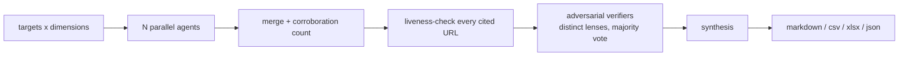

# UltimateScrape

[](https://github.com/Steviewonders99/ultimatescrape/actions/workflows/ci.yml)
[](LICENSE)
[](https://www.python.org/downloads/)
[](#install)

**An open-source deep research agent that checks its own homework.** It fans out
hundreds of small LLM agents over a research question, then does the part most
research agents skip: every URL an agent cites is liveness-checked, every finding
is attacked by independent adversarial verifiers, and every number in the final
report is computed in Python rather than recalled by a model.

Most deep-research tools hand you a confident report with citations nobody
checked. This one tells you which findings survived checking, which were refuted,
how many independent agents corroborated each, and which cited sources were dead.



## Why

- **Citations are treated as claims, not evidence.** A real GET on every cited
  URL, and a dead URL overrides any amount of model agreement.
- **Verifiers try to refute, not confirm.** Each gets a different lens — factual
  accuracy, recency, specificity. Three identical skeptics agree with each other;
  three different ones do not.
- **Models judge, code computes.** Every number, dedupe and URL check happens in
  Python and is asserted.
- **It stops itself.** A shared ledger raises the moment a run crosses your spend
  ceiling, so a runaway costs one call rather than your budget. ~$0.066/agent.
- **Interrupt it safely.** Every agent checkpoints to disk; `resume` re-dispatches
  only what never finished. You never pay twice.
- **Batteries for real research** — 61 government statistics and company-registry
  APIs catalogued with their individual quirks (41 need no key), competitor
  job-board feeds with published pay rates, and a local knowledge graph that
  accumulates across runs with full provenance.

## Quickstart

```bash
git clone https://github.com/Steviewonders99/ultimatescrape.git
cd ultimatescrape
uv venv --python 3.13 && uv pip install -e ".[dev,export]"
```

Two commands work with **no credentials at all** — start there:

```bash
uscrape platforms                              # 18 competitor platforms, and how each is reached
uscrape jobs -p imerit -p appen --pay-only     # live listings with published pay rates
```

Add one key (`OPENROUTER_API_KEY`) and the research engine turns on:

```bash
uscrape doctor                                    # what's live before you spend anything
uscrape company "Toast" "Square" "Lightspeed"     # 3 companies x 8 dimensions = 24 agents
uscrape market "United States" "Canada" -t "restaurant POS software"
uscrape vendor -c Brazil -c Vietnam -p "small video data collection studios"
uscrape resume latest                             # finish an interrupted run, paying only for gaps

uscrape ga4 run geo --days 28                     # engagement by country and city
uscrape graph show "Scale AI" --provenance        # what we know, and who said it
```

Windows users: run `.\setup.ps1` and see [`ONBOARDING.md`](ONBOARDING.md).

Everything is configured in [`uscrape.toml`](uscrape.toml) — output formats, which
competitors to watch, whether the graph is on. Environment variables override it,
so CI never needs the file edited.

If this is useful to you, a star helps other people find it.

---

## Why it is built this way

Five swarm-research systems already existed across three sibling repositories.
Each had one or two of the necessary pieces and none had all of them: retry and
backoff lived only in the census swarm, model fallback chains only there too, key
pooling only in one worker, credit pre-flight in another, TTL caching with
failure-gated writes only in the cultural-research engine, resumable job queues
only in the supervisor, and consensus voting only in the census swarm.
Nothing anywhere accumulated cost in dollars or enforced a token budget, so a
fan-out crash lost everything.

UltimateScrape is those pieces in one place, plus the things none of them had:
per-host politeness, robots handling, a real retry policy on fetches, HTML→markdown
extraction, and incremental checkpointing.

### The decomposition that does the work

A run is **targets × dimensions**. A target is a thing being researched (a country,
a company, a market). A dimension is one angle applied to targets (competitors,
hiring signals, regulation, pricing). Forty targets by eight dimensions is 320
independent agents.

This matters more than any other design choice here. One large prompt asking about
forty countries returns shallow, evenly-hedged prose. Three hundred small prompts,
each asking one question about one country, return specifics — and each is
separately cacheable, retryable, skippable, and cheap.

### The division of labour between model and code

Models supply **mappings, judgements, and prose**. Python computes **every number,
every deduplication, and every URL check**, and asserts the results. That split is
what makes a 300-agent run trustworthy rather than merely large, and it is lifted
directly from the census language swarm, which was the most reliable of the
predecessors precisely because it never let an LLM do arithmetic.

---

## Install in more detail

```bash
uv venv --python 3.13
uv pip install -e ".[dev,export]"
cp .env.example .env          # then set OPENROUTER_API_KEY
```

`config.py` reads `./.env` first, then any file listed in `USCRAPE_ENV_FALLBACKS`,
which lets you point at an existing `.env` elsewhere instead of copying secrets
into a second file. Separate paths with the platform separator (`;` on Windows,
`:` elsewhere).

Two optional tiers. Both are heavy, and neither activates on its own — the browser
tier is used only when an HTTP fetch comes back thin, and the LinkedIn parser tier
stays inert until you give it a session.

```bash
uv pip install -e ".[crawl]" && crawl4ai-setup                    # headless browser
uv pip install -e ".[linkedin]" && patchright install chromium    # LinkedIn parsers
```

Read [`docs/LINKEDIN.md`](docs/LINKEDIN.md) before enabling the second one.

## Layers

```
sources/     official APIs — 61 catalogued, 41 usable with no key at all
jobboards/   competitor and worker-gig feeds, with published pay rates
ga4/         analytics reporting, no Google SDK required
fetch/       polite HTTP with retries and robots, plus a Crawl4AI browser tier
channels/    URL → access path, with tiered fallback and health checks
swarm/       fan-out, merge, URL validation, adversarial verification, synthesis
graph/       local knowledge graph accumulating entities and provenance
output/      one row model → markdown, json, csv, xlsx, html, mermaid
publish/     SharePoint upload via Microsoft Graph
store/       run directories, per-unit checkpoints
```

### `sources/` — official statistics and registries

61 sources catalogued as data rather than code, because sixty statistics agencies
share about five protocols. Implementing the protocols (PxWeb 1.x and 2.0, SDMX,
OData, the Census matrix shape) and describing the agencies as data is the only
version of this that stays maintainable.

Every entry records the quirk that will otherwise cost you an afternoon. A sample
of what is already encoded:

- **US Census** now requires a key for *every* query; the widely-cited 500/day
  keyless tier is gone, and suppressed cells arrive as `-666666666`.
- **Companies House** uses HTTP Basic with the key as the *username* and an empty
  password, not a Bearer token.
- **World Bank** signals throttling as a **502 HTML page or a read timeout, never a
  429** — under a burst, valid URLs start failing in ways that look like malformed
  requests. (I chased both the `date=2022:2023` colon and the `USA;BRA` separator
  as suspects before establishing that both are fine and pacing was the issue.)
- **ISTAT** blocks your IP for one to two days above 5 requests/minute.
- **OECD** allows 60 downloads/hour and blocks VPN traffic outright.
- **IMF**'s legacy API was retired in Nov 2025; **FAOSTAT** went JWT-only in Apr
  2026; `odata4.cbs.nl` and `api.data.abs.gov.au` no longer resolve at all.

```bash
uscrape sources --ready              # what works right now
uscrape sources --protocol pxweb     # everything sharing one adapter
uscrape census --var B01003_001E --var B19013_001E --for "state:*"
```

### `channels/` — tiered access with health checks

Borrowed from Agent-Reach, which is the one genuinely good idea in that project.
A channel declares which URLs it handles and an ordered list of backends; the
dispatcher routes, and the channel walks its tiers until one succeeds. Access
becomes a configuration decision rather than a code change, and `uscrape doctor`
tells you which tiers are live *before* a run instead of forty minutes into one.

### `jobboards/` — competitor intelligence

The finding that shaped this: almost every AI-data competitor runs corporate
hiring on a standard ATS with a public JSON API, so **one adapter covers nine
companies** — no scraping, no browser, no meaningful rate limits. A handful run
custom endpoints, and those are the valuable ones, because they publish **worker
pay rates** that corporate boards do not.

```bash
uscrape platforms          # 18 competitors and how each is reached
uscrape jobs --pay-only    # only listings with a published rate
uscrape jobs --gigs        # worker gigs, not corporate roles
```

Live as of the last run: iMerit 22/23 listings carry rates, Appen 49/49, Handshake
121/130, TELUS 54/121. iMerit is the clearest window on geographic rate arbitrage —
identical English transcription work priced very differently by country.

Board tokens are recorded because most are not guessable: Invisible is `agency`,
Sama is `samainc`, Appen is `appen` and not the `appen-2` its own site advertises.

### `ga4/` — analytics for the market research team

Deliberately built with **no Google SDK**. Both halves of Google's auth are plain
HTTP, so this needs no `gcloud`, no key file, and no native builds — it runs
unchanged on a Windows laptop. Fourteen named reports, each answering a question
rather than requiring you to know API field names.

```bash
uscrape ga4 reports                  # the catalogue
uscrape ga4 run devices -f xlsx      # device and OS mix as a spreadsheet
uscrape ga4 run device-by-country    # does device preference differ by market?
uscrape ga4 fields -s engagement     # valid field names, so nobody guesses
```

Three API behaviours are handled rather than left to bite: the nine-dimension
ceiling, `(not set)` being a literal string rather than null, and offset
pagination for anything wide.

> A refresh token is tied to the account that minted it and expires if that
> account's password changes or it goes ~6 months unused — the error is
> `invalid_grant`. See [`docs/API_KEYS.md`](docs/API_KEYS.md).

### `graph/` — local knowledge graph

SQLite, single file, no server. The point is accumulation: the second question
about a company should be cheaper than the first. Two extraction passes —
deterministic first (from finding fields, no model call, no chance of
hallucination), then optional LLM extraction for relations stated only in prose.
That ordering means a model failure costs richness, never correctness.

```bash
uscrape graph stats
uscrape graph search "Scale"
uscrape graph show "Scale AI" --depth 2 --provenance
uscrape graph export -f mermaid
```

Observations are append-only and every edge carries the run, agent, and URL that
produced it — so the graph can always answer "says who?", and can be corrected
when a source turns out to be wrong. Re-observing an edge increments its weight
rather than duplicating it, so weight reads as a corroboration count.

### `output/` — one row model, seven formats

Findings, job listings, GA4 rows, and graph edges all become the same `Dataset`,
so a CSV of GA4 geo data and a CSV of research findings have identical shape and
provenance columns. A research team that gets a differently-shaped spreadsheet
from every command ends up rebuilding them all by hand.

CSV is written with a UTF-8 BOM so Excel on Windows renders accents correctly, and
xlsx splits by verdict with frozen headers and autofilters.

### `swarm/` — the run pipeline

1. **pre-flight** — credit check, backend health, work-matrix expansion, resume scan
2. **research** — fan-out under a semaphore, each result checkpointed the instant it lands
3. **merge** — dedupe with corroboration counting and field back-fill
4. **validate** — liveness-check every URL the agents claimed *(deterministic, free)*
5. **verify** — N adversarial verifiers per finding, each with a distinct lens
6. **synthesize** — one judgement pass over the verified set
7. **report** — markdown plus machine-readable JSON

Step 4 is the highest-value step in the system and it costs nothing. The vendor
swarm established that LLM-reported URLs are wrong often enough that an unvalidated
list poisons the whole dataset.

Step 5 uses *different* lenses per verifier rather than N identical skeptics —
three identical skeptics agree with each other; three different ones don't.

---

## Using it from Python

```python
import asyncio
from ultimatescrape import Swarm
from ultimatescrape.swarm.spec import SwarmSpec, Target, Dimension
from ultimatescrape.swarm.prompts import RESEARCH_SYSTEM

spec = SwarmSpec(
    topic="EU AI Act compliance vendors",
    targets=[Target.of(c) for c in ("Germany", "France", "Ireland")],
    dimensions=[
        Dimension("vendors", "Who sells AI Act compliance tooling in {label}?"),
        Dimension("pricing", "What does AI Act compliance tooling cost in {label}?"),
    ],
    system_prompt=RESEARCH_SYSTEM,
    output_contract='{"findings":[{"name":"","summary":"","url":"","confidence":""}]}',
    verifier_votes=3,
)

async def main():
    async with Swarm() as swarm:
        result = await swarm.run(spec)
    print(result.stats, result.ledger["cost_usd"])

asyncio.run(main())
```

---

## Cost and safety

A hard ceiling (`USCRAPE_MAX_RUN_COST_USD`, default $25) is enforced in a shared
ledger that every agent writes to. It raises the moment the ceiling is crossed, so
a runaway costs one call's overrun rather than the budget. Observed rate on a live
run: **~$0.066 per grounded agent**, so a 24-agent company sweep lands near $1.60.

Interrupted runs resume with `uscrape resume <run_id>`. Each work unit is written
to disk atomically as it completes, and only missing or errored units are
re-dispatched — a three-hour 200-agent job becomes interruptible instead of
all-or-nothing.

## Publishing to SharePoint

Uses an Azure AD app registration with Microsoft Graph application permissions.
If your organisation already has one for SharePoint automation, reuse it — three
environment variables, no new IT request.

```bash
uscrape publish latest --dry-run   # verify auth, site and folder access
uscrape publish latest             # confirms before uploading
```

Disabled by default and always an explicit command: uploading is outward-facing,
so finishing a run never publishes anything as a side effect. Note the app holds
**Sites.Selected**, so only sites an admin has explicitly granted are reachable.

## API keys

[`docs/API_KEYS.md`](docs/API_KEYS.md) covers every key — where to sign up, how
long it takes, and what breaks without it. Short version: you need **one** key
(OpenRouter) to use the system at all, and `CENSUS_API_KEY` if you want US Census
data, which as of 2026 is mandatory for every query rather than optional.

## LinkedIn

Read [`docs/LINKEDIN.md`](docs/LINKEDIN.md) before enabling anything beyond the
default tiers. Automated access violates LinkedIn's User Agreement and the
self-hosted tiers carry real account-restriction risk. The tier chain makes that an
explicit, configured decision. The operational detail that matters more than the
choice of library: **use one dedicated static ISP address per account and set the
proxy up before the session is created** — moving a logged-in session onto a new IP
is itself a checkpoint trigger, so a rotating residential pool is worse than none.

## Tests

```bash
.venv/bin/python -m pytest tests/ -q      # 51 passing, no network required
```
